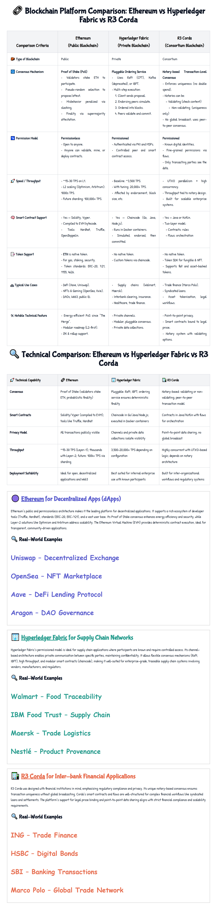

<h1 align="center" ; font-size: 32px; color: #2c3e50; padding-bottom: 10px;">
🧩 Mini Task Presentation
</h1>
 
This image represents a mini task outlined in the shared document at 
<a href="https://docs.google.com/document/d/1obxmP6mYYp5irqRa8uUrUFS67yahmLvqVsnbVdH_4sE/edit?tab=t.0" target="_blank">this Google Docs link</a>. The task has been carefully visualized to convey the concept in a compact and engaging way. Take a close look at the structure and insights captured in the image to better understand the logic and characteristics of the conveyed concepts.
 
 

---

## 🙏 Credits

This project was developed as part of a mini-task submission during my internship at **BlockseBlock**. I would like to express my sincere gratitude to the team at BlockseBlock for the opportunity to explore, compare, and analyze key blockchain platforms — Ethereum, Hyperledger Fabric, and R3 Corda — through a structured report that deepened my understanding of real-world blockchain architectures and their unique design philosophies.

---
